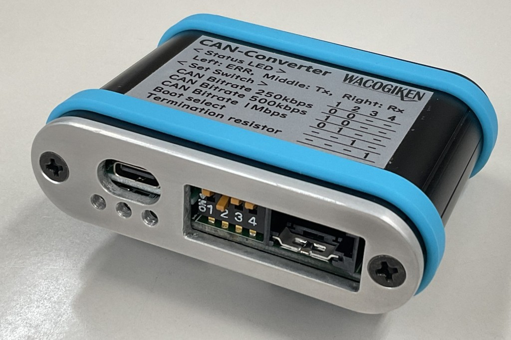

# USB(CDC) - CAN Bus Converter
USB Communications Device Class to CAN Bus simple converter

  

### CDC Serial Protocol

Packet : STX + Flag + ID + Data + CRC + ETX

STX : Start of Text (0x02)  
Flag : Hexadecimal ASCII fixed 2 characters

|bit7~5|bit4|bit3~0|Function
| :-: | :-: | :-: | :-
| --- |  0  | --- | Standard Format
| --- |  1  | --- | Extended Format
| --- | --- | 0~8 | Data Length Code

ID : Hexadecimal ASCII fixed 8 characters  
Data : Hexadecimal ASCII 0~16 variable characters ( DLC * 2 )  
CRC : Hexadecimal ASCII 4 fixed characters  
　from Flag to Data CRC-CCITT init=0xffff / poly=0x8408 / xor=0xffff  
ETX : End of Text (0x03)  

### sample : 
- Flag : 0x18 (Extnded Format & DLC=8 )
- ID : 0x00EF0102
- Data : 0xC3 0x09 0xC3 0x09 0x00 0x00 0x00 0x00
- CRC : 0xCC4B

| No. | char | hex | Function |
| :-: | :--: | :-: | :-
| +0  | STX  | 0x02 | Start of Text
| +1  | '1'  | 0x31 | Flag
| +2  | '8'  | 0x38 |
| +3  | '0'  | 0x30 | ID
| +4  | '0'  | 0x30 |
| +5  | 'E'  | 0x45 |
| +6  | 'F'  | 0x46 |
| +7  | '0'  | 0x30 |
| +8  | '1'  | 0x31 |
| +9  | '0'  | 0x30 |
| +10 | '2'  | 0x32 |
| +11 | 'C'  | 0x43 | Data
| +12 | '3'  | 0x33 |
| +13 | '0'  | 0x30 |
| +14 | '9'  | 0x39 |
| +15 | 'C'  | 0x43 |
| +16 | '3'  | 0x33 |
| +17 | '0'  | 0x30 |
| +18 | '9'  | 0x39 |
| +19 | '0'  | 0x30 |
| +20 | '0'  | 0x30 |
| +21 | '0'  | 0x30 |
| +22 | '0'  | 0x30 |
| +23 | '0'  | 0x30 |
| +24 | '0'  | 0x30 |
| +25 | '0'  | 0x30 |
| +26 | '0'  | 0x30 |
| +27 | 'C'  | 0x43 | CRC
| +28 | 'C'  | 0x43 |
| +29 | '4'  | 0x34 |
| +30 | 'B'  | 0x42 |
| +31 | ETX  | 0x03 | End of Text

### DIP Switch

| SW1 | SW2 | SW3 | SW4 | Funtion
| :-: | :-: | :-: | :-: | :-
| OFF | OFF | --- | --- | 250kbps
| ON  | OFF | --- | --- | 500kbps
| OFF | ON  | --- | --- | 1Mbps
| --- | --- | OFF | --- | Normal Mode
| --- | --- | ON  | --- | Boot Mode
| --- | --- | --- | OFF | Terminator OFF
| --- | --- | --- | ON  | Terminator ON

### LED

| abbr. | content | annotation | on | off |
| :-- | :-- | :-- | :-- | :-- |
| Tx | Transmit Data | send to CAN Bus | 100ms | min.50ms |
| Rx | Recieve Data | recv from CAN Bus | 100ms | min.50ms |
| ERR | Error | not connect PC | 1000ms | 500ms |
| ERR | Error | buffer over | 200ms | min.100ms | 

## **_Library_**
The [can2040](https://github.com/KevinOConnor/can2040) library is used.  
Copy "can2040.c" and "can2040.h" to "can2040/src".

## **_Licence_**
This software includes the following open source software. Please see below for details on copyright notices and licenses.

[can2040](https://github.com/KevinOConnor/can2040/blob/master/COPYING)

[TinyUSB](https://github.com/hathach/tinyusb/blob/master/LICENSE)  
Change the USB vendor ID and description string.

## **_Version History_**
* __v1.0__(2023/5/1)
    - First release

